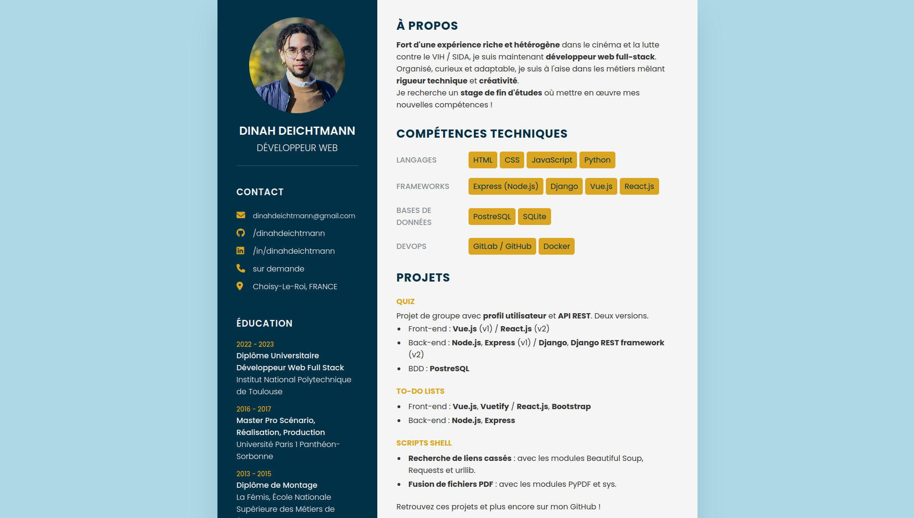

# Fully responsive online CV

This **online CV** is a **personal project** I built following a **live coding session** from Muhammad Irshad at [Online Tutorials](https://www.youtube.com/@OnlineTutorialsYT/about). It gave me a template that I then **tweaked to fit my needs**.

It is **fully responsive**. I also added some **CSS animations** that were **not included in the template**.

See the final result deployed [here](https://dinahdeichtmann.github.io/cv-fr/)!

## Technologies

- HTML
- CSS

## Other version

This is the French version. Find an English one online [here](https://dinahdeichtmann.github.io/cv-en/) or [here](https://github.com/dinahdeichtmann/cv-en) for the repository.

## Credit

- [Source Code](https://www.patreon.com/onlinetutorials)
